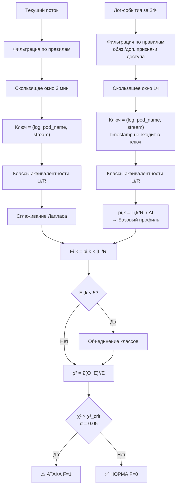

# Техническое задание для LLM-агента
## Разработка скрипта обнаружения атак несанкционированного доступа в кластере Kubernetes

---

## 1. Цель задачи

Реализовать Python-скрипт обнаружения несанкционированного доступа в кластере Kubernetes. Метод основан на статистическом профилировании лог-событий контейнеров: перед анализом поток логов фильтруется по признакам доступа, эталонное поведение описывается классами эквивалентности, а отклонение текущего потока от профиля оценивается критерием χ².

---

## 2. Входные данные

### 2.1. Поля лог-записей (Таблица 1)

| Категория | Поле | Назначение |
|---|---|---|
| Поведенческие | `log` | Фиксация попыток доступа к системным каталогам |
| Контекст | `pod_name` | Идентификация источника атаки |
| Ошибки | `stream` | Индикатор неуспешных попыток (`stderr`) |
| Время | `timestamp` | Анализ интенсивности и продолжительности атаки |

### 2.2. Формат лог-записи

Метод парсинга лог-записи нужно брать из скрипта /Users/eugeneshpchkv/anyasrkn/nir/script.py

---

## 3. Фильтрация событий перед анализом

> ⚠️ **Важно**: к анализу допускаются **только** лог-события, связанные с доступом. Лог-событие рассматривается, если выполняется **хотя бы один обязательный признак** из строки таблицы ИЛИ **все дополнительные признаки одной строки** одновременно.

### 3.1. Правила фильтрации

| # | Обязательные признаки | Дополнительные признаки |
|---|---|---|
| 1 | `log` содержит `grep` + одно из: `password`, `shadow` **ИЛИ** тип ошибки — `permission denied` | `stream == stderr` **И** доступ к системным каталогам (`/etc`, `/home`) |
| 2 | `log` содержит `sudo` **ИЛИ** тип ошибки — `authentication failure` | `stream == stderr` **И** `log` содержит `ssh` |
| 3 | Тип ошибки — `Failed password` **ИЛИ** `Invalid user` | `stream == stderr` |
| 4 | `log` содержит `tcpdump` **ИЛИ** `gcc` | Наличие `NET_RAW` ИЛИ `NET_ADMIN` ИЛИ `sudo` |
| 5 | `log` содержит `Cookies` **ИЛИ** `chrome` | `log` содержит `WhiteChocolateMacademiaNut` |
| 6 | `log` содержит `.netr` **ИЛИ** `find` | `stream == stderr` |
| 7 | `log` содержит `lazagne` **ИЛИ** чтение системных credential-хранилищ | `stream == stderr` **И** тип ошибки — `access denied` |
| 8 | `log` содержит `pam`, `sed` **ИЛИ** `1s,^,` | `stream == stderr` **И** тип ошибки — `permission denied` |

### 3.2. Алгоритм фильтрации

```python
def is_access_event(log_entry: dict) -> bool:
    """
    Возвращает True, если лог-событие связано с доступом
    и должно быть включено в анализ.
    Правило: обязательный признак строки ИЛИ все допол. признаки строки.
    """
```

---

## 4. Алгоритм обнаружения атак

Способ подключения к инфраструктуре и получения лог-записей брать из скрипта /Users/eugeneshpchkv/anyasrkn/nir/script.py.

### 4.1. Правило классов эквивалентности

> Два лог-события принадлежат **одному классу эквивалентности**, если совпадают все рассматриваемые поля **кроме `timestamp`**.

Ключ класса: `(log, pod_name, stream)` — поле `timestamp` в ключ **не входит**, используется только для нарезки окон.

### 4.2. Построение эталонного профиля

1. Загрузить лог-события за **24 часа** (`T0`)
2. Отфильтровать события по правилам раздела 3
3. Нарезать **скользящим окном 1 час** → интервалы `T = {T0, T1, ..., TM}` (формула 1)
4. Для каждого интервала `Ti`:
   - Сформировать ключи `(log, pod_name, stream)` для каждого события
   - Сгруппировать в классы эквивалентности `Li/R` (формулы 5–6)
   - Вычислить `pi,k = |li,k/R| / ∆t` (формула 7)
5. Сохранить профиль: `{hour_of_day → {class_key → probability}}`

### 4.3. Обнаружение атаки в потоке

1. Для каждого скользящего окна **3 минуты** из потока:
   - Отфильтровать события по правилам раздела 3
   - Сформировать классы эквивалентности `Li/R` по ключу `(log, pod_name, stream)`
   - Определить час → взять срез базового профиля
2. Применить **сглаживание Лапласа**:
   - Новый класс (не в профиле) → добавить с частотой 1
   - Всем остальным классам профиля → прибавить 1 (единожды за интервал)
3. `Ei,k = pi,k × |Li/R|` (формула 8)
4. Объединить классы с `Ei,k < 5` в один суммарный класс (условие χ²)
5. `χ² = Σk (Oi,k − Ei,k)² / Ei,k` (формула 9)
6. `df = |Li/R| − 1` (формула 10)
7. `χ²_crit` при `α = 0.05` через [`scipy.stats.chi2.ppf(0.95, df)`](https://docs.scipy.org/doc/scipy/reference/generated/scipy.stats.chi2.html)
8. `F(L) = 1` (атака) если `χ² > χ²_crit`, иначе `F(L) = 0` (норма) — формула 11

### 4.4. Диаграмма потока данных



---

## 5. Технические требования

| Параметр | Значение |
|---|---|
| Язык | Python 3.10+ |
| Библиотеки | `pandas`, `numpy`, `scipy`, `re`, `json`, `logging`, `pickle` |
| Ключ класса эквивалентности | `log`, `pod_name`, `stream` (без `timestamp`) |
| `timestamp` | только для нарезки окон и сопоставления с профилем |
| Окно профилирования | 1 час |
| Окно обнаружения | 3 минуты |
| Уровень значимости α | 0.05 |
| Минимальное `Ei,k` | 5 (иначе объединение) |

---

## 6. Структура проекта

```
attack_detector/
├── main.py                        # CLI-интерфейс, точка входа
├── filter.py
│   └── is_access_event()          # фильтрация по обяз./доп. признакам
├── profiler.py
│   ├── make_class_key()           # (log, pod_name, stream) → hashable key
│   ├── build_equivalence_classes()
│   └── compute_baseline()         # pi,k, сохранение профиля
├── detector.py
│   ├── apply_laplace_smoothing()
│   ├── merge_low_expected()       # Ei,k < 5 → объединение
│   ├── compute_chi2()
│   └── detect_attack()            # F(L) → {0, 1}
└── utils.py                       # чтение, скользящее окно, отчёт
```

---

## 7. Выходные данные

Для каждого 3-минутного окна — строка лога:
```
[2026-06-15 21:03:00] NORMAL  | χ²=3.42  | df=5 | χ²_crit=11.07 | events=12
[2026-06-15 21:06:00] ⚠️ ATTACK | χ²=28.71 | df=5 | χ²_crit=11.07 | pod=nginx-abc
```

JSON-отчёт: список окон с `window_start`, `chi2`, `chi2_crit`, `df`, `is_attack`, `filtered_events_count`.

---

## 8. Критерии приёмки

- [ ] Фильтр [`is_access_event()`](attack_detector/filter.py) корректно применяет правила: обязательный признак **ИЛИ** все дополнительные признаки одной строки
- [ ] Все 8 групп признаков из таблицы реализованы и покрыты тестами
- [ ] Ключ класса эквивалентности формируется из `log`, `pod_name`, `stream` — поле `timestamp` исключено
- [ ] Сглаживание Лапласа применяется корректно при появлении новых классов
- [ ] Классы с `Ei,k < 5` объединяются перед вычислением χ²
- [ ] На тестовых данных с `sudo + authentication failure` скрипт выдаёт `F(L) = 1`
- [ ] На тестовых данных с `grep shadow + permission denied + stream=stderr + /etc` — `F(L) = 1`
- [ ] На нормальном трафике (события не проходят фильтр или χ² ≤ χ²_crit) — ложные срабатывания ≤ 5%
- [ ] Unit-тесты: [`is_access_event()`](attack_detector/filter.py), [`make_class_key()`](attack_detector/profiler.py), [`compute_chi2()`](attack_detector/detector.py), [`apply_laplace_smoothing()`](attack_detector/detector.py), [`merge_low_expected()`](attack_detector/detector.py)

## 9. Важное замечание

НЕ НУЖНО ОПИРАТЬСЯ НА ДРУГИЕ ФАЙЛЫ ИЗ /Users/eugeneshpchkv/anyasrkn/nir КРОМЕ script.py. ЭТО ОСТАТКИ НЕПРАВИЛЬНОЙ РЕАЛИХЗАЦИИ